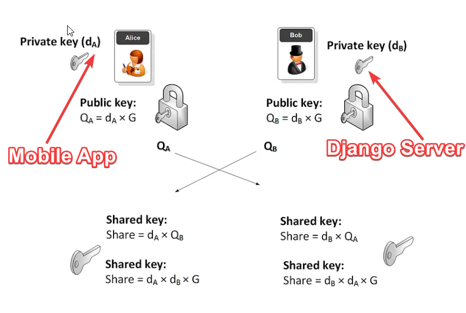
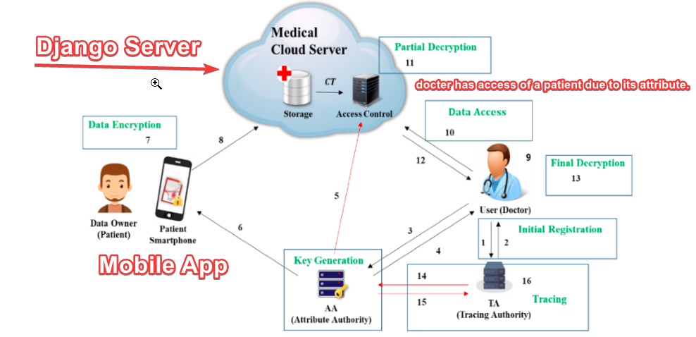

# Secure Communication Project for Patients and Doctors


## Overview

This Django project facilitates secure communication between patients and doctors. It employs advanced cryptographic techniques, including ECDH (Elliptic Curve Diffie-Hellman) encryption for patients and ABE (Attribute-Based Encryption) for doctors. The project ensures the confidentiality and integrity of patient-doctor interactions while allowing authorized doctors to edit patient data.

## Privacy for Health Data - HIPAA Compliance Solution
Healthcare organizations and professionals handle sensitive patient data, making privacy and security paramount. Our HIPAA Compliance Solution is designed to address the stringent requirements of the Health Insurance Portability and Accountability Act (HIPAA) while safeguarding the confidentiality and integrity of health data.

### HIPAA Features
- Data Encryption:
    Our solution employs robust encryption mechanisms to protect health data both in transit and at rest. This ensures that patient information remains confidential and secure.

- Access Controls:
    Granular access controls and role-based permissions restrict access to patient records. Only authorized healthcare professionals can view and edit sensitive data.

-  Audit Trails:
    Comprehensive audit trails capture and log all data access and modification activities. This provides transparency and accountability, allowing organizations to track any unauthorized or suspicious activities.

- Secure Communication:
    Encrypted communication channels guarantee secure communication between healthcare professionals, ensuring that patient data remains private during transmission.

-  User Authentication:
    Strong user authentication measures, including multi-factor authentication (MFA), protect against unauthorized access to the system.

-  HIPAA Compliance:
    Our solution aligns with HIPAA regulations, including the Privacy Rule, Security Rule, and Breach Notification Rule. We prioritize compliance to mitigate legal and financial risks.

- Data Backup and Recovery:
    Regular data backups and disaster recovery procedures are in place to prevent data loss and maintain business continuity.

## Why HIPAA Compliance Matters
HIPAA regulations are in place to protect patients' rights to privacy and ensure the security of their health information. Non-compliance can result in severe penalties, legal consequences, and damage to an organization's reputation. Our solution is committed to HIPAA compliance, providing peace of mind to healthcare providers and their patients.

## Project Features

- Patient Communication (ECDH Encryption): Patients    can send and receive secure messages with end-to-end ECDH encryption. This ensures that only authorized recipients can decrypt and access the messages.

- Doctor Communication (ABE Encryption): Doctors have the capability to communicate securely using ABE encryption. They can also edit patient data, ensuring data privacy and integrity.

- User Registration and Authentication: Secure user registration and authentication processes are in place to protect access to patient and doctor functionalities.

- Message History: A message history feature allows users to review past communications securely.

- User-Friendly Interface: The web interface is designed to be user-friendly and intuitive.

## ECDH (Elliptic Curve Diffie-Hellman):

ECDH is a key exchange protocol used to establish a shared secret between two parties over an insecure communication channel. The main goal of ECDH is to enable secure communication by allowing two parties to agree on a secret key without exchanging it directly.
Here's why ECDH is commonly used:
- Forward Secrecy: ECDH provides forward secrecy, meaning that even if a party's private key is compromised in the future, it won't compromise past communications. Each session generates a new set of keys, making it more resilient against attacks.
- Strong Security: ECDH offers a high level of security with shorter key lengths compared to traditional RSA-based key exchange methods, making it more efficient in terms of computational resources.
- Perfect Forward Secrecy (PFS): By utilizing ECDH, all data encrypted using the session key remains secure, even if the long-term private keys are exposed later.
- Support for Elliptic Curve Cryptography: Elliptic curve cryptography offers strong security with shorter key lengths compared to traditional RSA cryptography, making it ideal for resource-constrained devices like mobile phones and IoT devices.




## ABE (Attribute-Based Encryption):

ABE is an advanced encryption scheme that allows access control over encrypted data based on attributes or policies defined for users. In ABE, data is encrypted with a set of attributes, and decryption is possible only for users who possess a matching set of attributes that satisfy the access policy.

Here's why ABE is used:
-  Fine-Grained Access Control: ABE allows for fine-grained access control over data. Different users can be granted access to different pieces of encrypted data based on their attributes or specific policies.
- Data Sharing and Collaboration: ABE enables secure data sharing and collaboration scenarios. Users can encrypt data with specific attributes, and only users possessing matching attributes can decrypt and access the data.
- Flexible Access Policies: ABE allows for flexible and expressive access policies to be defined, enabling complex access control scenarios that may involve multiple attributes and logical combinations.
- Confidentiality in Outsourced Environments: ABE can be particularly useful when data needs to be outsourced to a third-party cloud service while still maintaining fine-grained access control over the encrypted data.



## Prerequisites

- Python 3.x
- Django
- Cryptography library for ECDH.
- ABE (Saperate container for this environment)
- Docker and Docker Compose
- Mobile App (python kivi framework for mobile app)


## Security Considerations

- Always use strong and unique passwords.

- Safeguard secret keys and encryption parameters.

- Keep the project dependencies up to date and apply security patches regularly.

## Configuration
- clone the project.
- open terminal in the project
- run command ```docker compose up -d```
- check backend running on ```http://localhost:8000/```
